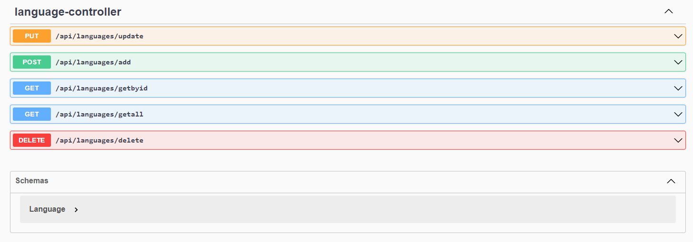

# Kodlama.io.Devs
Adayların kodlama becerilerini iş verenlerle buluşturduğu bir proje.

:white_check_mark: **Kampın 4. Haftası:**

Basit bir gereksinimle başlayalım.

Req 1 : Sistemde programlama dilleri tutulmalıdır.

- Programlama dillerini(C#,Java,Python) ekleyebilecek, silebilecek, güncelleyebilecek, listeleyebilecek, id ile getirebilecek kodları yazınız. Bunu tamamen in memory yapınız.

- İsimler tekrar edemez.

- Programlama dili boş geçilemez. (Validation kullanmadan, kod yazarak algoritmik çözünüz)

