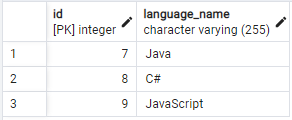
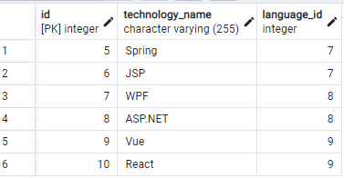

# Kodlama.io.Devs
Adayların kodlama becerilerini iş verenlerle buluşturan bir proje.
- Bu projeye kodlama.io java kampının 4. haftası ile başlanılmıştır.
- Her hafta kampta belirlenen yeni gereksinimlere göre code refactoring yapılarak devam edilecektir.
## 

 **Kampın 4. Haftası:**

Basit bir gereksinimle başlayalım.

Req 1 : Sistemde programlama dilleri tutulmalıdır.

- Programlama dillerini (C#,Java,Python) ekleyebilecek, silebilecek, güncelleyebilecek, listeleyebilecek, id ile getirebilecek kodları yazınız. Bunu tamamen in memory yapınız.

- İsimler tekrar edemez.

- Programlama dili boş geçilemez. (Validation kullanmadan, kod yazarak algoritmik çözünüz)

## 

 **Kampın 5. Haftası:**

Req 2 : Sisteme programlama dillerine ait alt teknolojiler eklenebilmeli, silinebilmeli. güncellenebilmeli, listelenebilmelidir.

Örneğin; 
- Java : Spring, JSP.
- C#: WPF, ASP.NET ,
- JavaScript : Vue, React

